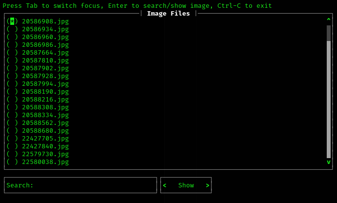
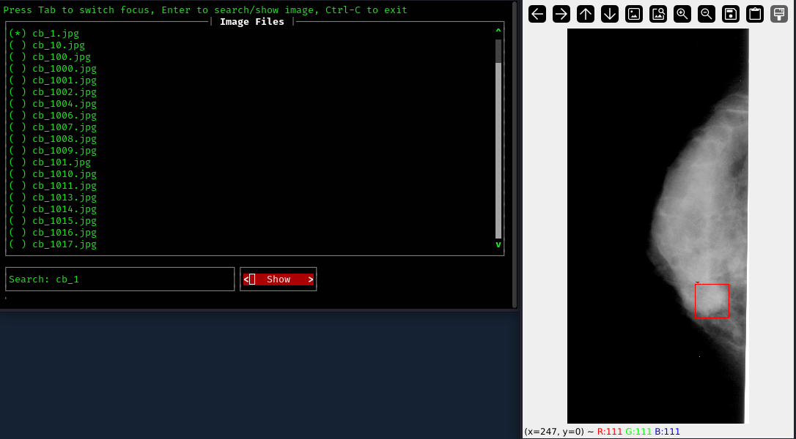

# Object Detection Utils
* Utility scripts used in object detection model training and testing
* Utility functions and classes are easy to import in your projects

# Requirements
Before using any of the tools, install requirements:
```bash
pip install -r requirements.txt
```

# List of Tools
## Visualizer
Visualize standardized object detection datasets
### Features
* Support COCO and YOLO style dataset
* Live search for files

### COCO Style dataset
```bash
python visualizer.py -m coco -d train/images -l train.json 
```

### YOLO Style dataset
```bash
python visualizer.py -m yolo -d train/images -l train/labels 
```
Choose image             |  Visualize
:-------------------------:|:-------------------------:
 | 

---

## YOLO to COCO Converter
A simple script to convert YOLO annotations to COCO format.
### Usage
```bash
python yolo_to_coco.py <yolo_annotations> <image_dir> <output_file>
```
*    <yolo_annotations>: Directory with YOLO .txt files.
*    <image_dir>: Directory with corresponding images.
*    <output_file>: Output COCO JSON file.

## COCO to YOLO Converter
A simple script to convert YOLO annotations to COCO format.
### Usage
```bash
python coco_to_yolo.py -c <coco_annotation_json> -i <image_dir> -o <output_labels_path>
```
*    <coco_annotation_json>: Path to COCO annotations JSON file.
*    <image_dir>: Directory with corresponding images.
*    <output_labels_path>: Path to output yolo labels directory path.

---

## Histogram
Draw histogram of colored or grey images
* Support medical DICOM image format
* Support PNG / JPEG
* Auto-detect colored / grey images
* Hover on chart to get exact pixel intensity values
### Usage
```bash
python histogram.py <image_path>
```